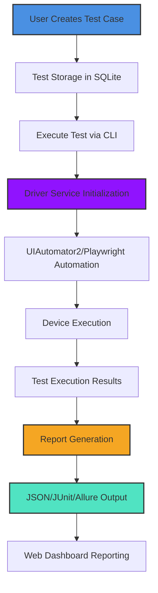
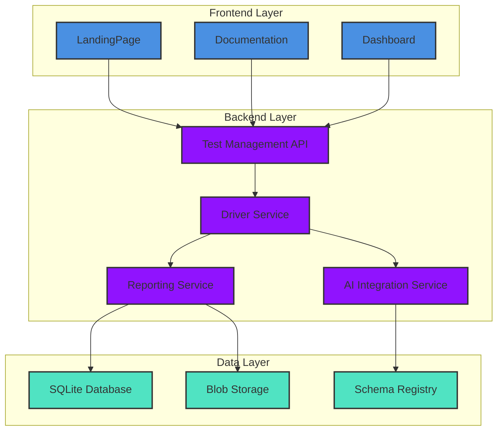

# Architecture: Overview Heimdall Web

Rangkuman arsitektur sistem Heimdall dengan menyoroti komponen utama, alur data, struktur modul, dan teknologi stack yang digunakan. Dokumentasi ini memandu pengembang serta pengguna sistem untuk memahami kompleksitas arsitektur Heimdall.

## 1. Overview System

Heimdall dibangun sebagai **platform turutmodern testing AI-powered** yang mencakup dua sistem utama:
1. **Heimdall Web** - Interface pengelolaan test case & reporting (front-end + back-end)
2. **Heimdall CLI** - Command line interface untuk eksekusi test (core automation engine)

**Heimdall Web** berfungsi sebagai:
- Manajemen test case & test suite
- Dashboard statistik & pelaporan
- Integraasi CI/CD
- TMS (Test Management System) integration
- Pengaturan automation

**Heimdall CLI** berfungsi sebagai:
- Eksekusi test di device / emulator
- Inisialisasi automation driver
- Reporting dan output format
- Konfigurasi parallel & device management

## 2. Component System

Struktur komponen arsitektur Heimdall dibagi menjadi 3 lapisan utama:

### 2.1 Presentation Layer (Frontend)

Component ini bertanggung jawab atas antarmuka pengguna:
- **Landing Page** (Hero + Mockup + Features)
- **Documentation** (Menus, Navigation, Search)
- **Test Runner Dashboard** (Status, Report, Logs)
- **Setting & Configuration** (Project settings, Device management)

### 2.2 Application Layer (Core API & Services)

Component ini mengimplementasikan logika bisnis sistem:
- **Test Management Service** (Test case storage, Execution)
- **Driver Management Service** (UIAutomator2, Playwright)
- **Reporting Service** (JSON, JUnit, Allure)
- **AI Integration Service** (Text-to-Script, Smart Suggestions)
- **API Testing Service** (API Management & Assertions)

### 2.3 Data Layer (Storage & Infrastructure)

Component ini mengelola penyimpanan data:
- **SQLite Database** (Test cases, Devices, Configurations)
- **Blob Storage** (Report attachments, Metadata)
- **File System** (Scenarios `.heim`, Baseline images, Dataset)
- **Cache Layer** (Data Center indexing, Recent runs)

## 3. Data Flow

Berikut adalah alur data utama dalam eksekusi test:



### 3.1 Detail Alur Data

1. **Create Test Case** - Pengguna menulis skenario menggunakan sintaks `.heim` atau UI Test Builder
2. **Store Test** - Test case disimpan di database SQLite dengan metadata (name, description, tags)
3. **Execute Test** - Tekan tombol "Run" atau CLI: `heimdall run <scenario>.heim`
4. **Initialize Driver** - Engine memilih driver berdasarkan target (Android/iOS/Web)
5. **Automation Execution** - Driver memproses skenario dan mengeksekusi aksi di device
6. **Assertion** - Setiap langkah di-check untuk validasi
7. **Result Collection** - Hasil (pass/fail/time) dikumpulkan di database
8. **Report Generation** - Output format (JSON, JUnit, HTML) dibuat
9. **Web Dashboard** - Laporan terlihat di antarmuka web

## 4. Module Structure

Struktur direktori yang mundurheimdall-web follows a clean separation of concerns:

```
src/
├── components/          # Reusable UI components
│   └── ui/               # Primitive components (Button, Card, etc.)
├── modules/             # Business logic modules
│   ├── landing/          # Landing page components
│   └── layout/           # Layout components (Navbar, Footer)
├── pages/               # Page templates with routing
│   ├── Documentation.tsx # Existing test docs page
│   └── NotFound.tsx      # Error page
├── App.tsx              # Main routing configuration
└── index.ts             # Entry point
```

### 4.1 Detailed Module Structure

#### 4.1.1 Landing Module (`modules/landing/`)

- **FeatureOverview.tsx** - Menampilkan fitur utama Heimdall
- **QuickLinks.tsx** - Link cepat ke dokumentasi
- **Hero.tsx** - Sebuah hero section besar dengan animasi fire animation + background retro
- **RoadmapSection.tsx** - Menunjukkan jalur pengembangan fitur
- **FAQSection.tsx** - Frequently Asked Questions

#### 4.1.2 Layout Module (`modules/layout/`)

- **Footer.tsx** - Footer global dengan brand info & links
- **Navbar.tsx** - Navigation utama dengan:
  - Item menu: Beranda, UI Preview, Desktop App, Semua Fitur, Dokumentasi, Kontak
  - Mobile responsive design dengan hamburger menu
  
#### 4.1.3 Documentation Component (`pages/Documentation.tsx`)

- Existing dokumentasi yang sebelumnya hanya tersedia di application
- Menyediakan **sidebar navigation** dengan tema vertical dengan:
  - 5 menu utama: Pengenalan, Instalasi, Syntax & Perintah, Struktur Script, Troubleshooting
  - **"Butuh bantuan?"** call-to-action
  - Documentation-specific sections

#### 4.1.4 Reusable UI Components

- **WindowCard** - Komponen transparan dengan efek retro card
- **SectionWrapper** - Container dengan animasi masuk-fade
- **FAQSection** - FAQ dengan accordion-style toggle
- **MockupGallery** - Gallery images dengan transisi page

## 5. Tech Stack

Heimdall construct dengan teknologi modern berikut stack teknis lengkap:

### 5.1 Core Framework

- **React 18.3.1** - Primary library for building UI
- **TypeScript** - For type-safety and developer experience

### 5.2 Build & Bundling

- **Vite 5** - Build tool for frontend performance
- **TypeScript Compiler** - For type checking

### 5.3 Styling & UI

- **Tailwind CSS 3** - Utility-first CSS framework
- **PostCSS** - For CSS preprocessing
- **Custom Retro Theme** - Theme dengan warna retro-bg, retro-border, retro-sm, dll

### 5.4 Animation & Motion

- **Framer Motion** - Untuk animasi motion: SectionWrapper, FAQ transition

### 5.5 Iconography

- **Lucide React** - Seperti aos separated icons collection

### 5.6 Application Features

- **uiautomator2** - Android automation driver
- **Playwright** - Web automation driver
- **AI Providers** - OpenAI, Google Gemini, Ollama (local LLMs)
- **SQLite** - Local database storage
- **Graphviz** - Mindmap diagram generation
- **Allure** - Report generation

### 5.7 Infrastructure

- **Netlify** - Deployment platform
- **GitHub Actions** - CI/CD pipeline
- **Docker** - Containerization support

## 6. Technology Details

### 6.1 VitePress Theme Implementation

Dokumentasi web Heimdall menggunakan **VitePress** dengan custom theme:

- **Home Theme**: Custom theme dengan warna retro dan dark mode toggle
- **Custom CSS** : file `custom.css` untuk styling khusus
- **Sidebar Navigation**: Mengikuti template dari spec-1
- **Navigation Components**:
  - Top navigation dengan 5 menu utama
  - Konfigurasi sidebar penuh untuk navigasi
  - Breadcrumb trail otomatis

### 6.2 Dark Mode Implementation

- **Theme Toggle Button** - Tombol di Navbar untuk pestafenya mode
- **Color Mode Persistance** - Simpan preferensi ke `localStorage`
- **CSS Variables** - Gunakan CSS variables untuk tema:
  - `--retro-bg`, `--retro-dark-bg`, `--retro-border`
  - `--retro-sm`, `--retro-lg` shadow variants
  - `--glow-emerald`, `--glow-purple`, `--glow-green` untuk highlight

### 6.3 Custom Scrollbar & Animations

- **Custom Scrollbar Styling** - untuk tema retro
- **Animations**:
  - `blob` animation untuk loading state
  - `fade-in-up` untuk section intro
  - `pulse-slow` untuk responsive indicators
  - `float` untuk call-to-action elements

### 6.4 Responsive Design Stack

Dengan **Mobile-First Responsive** approach:

| Viewport | Description |
|----------|-------------|
| `<640px` | Mobile view with hamburger menu |
| `640px-1024px` | Tablet view with collapsible sidebar |
| `>1024px` | Desktop view dengan sidebar tetap | 

- **Breakpoints**:
  - `sm`: 640px
  - `md`: 768px
  - `lg`: 1024px

### 6.5 API Testing Suite

Integrasi API testing menjadi bagian dari keyword DSL Heimdall:

- **API Test Execution**: `heimdall api-test <file.json>`
- **Supported Methods**: POST, PUT, GET, DELETE
- **Assertion Types**:
  - Status Code
  - Response Time (maxMs)
  - Body JSONPath queries
  - Header Validation
- **Authentication Support**: Bearer token, Basic Auth

## 7. System Integrations

### 7.1 CI/CD Integration

Heimdall mendukung integrasi dengan CI/CD pipeline famous:
- **GitHub Actions** - Workflow contoh di `./templates/ci/githab-actions.yml`
- **GitLab CI** - Configuration templates
- **Jenkins** - Pipeline examples
- **CircleCI** - Configuration examples

### 7.2 TMS Integration

- **Test Case Management Systems**:
  - JIRA
  - TestRail
  - Azure Test Plans
  - Upload Integration (CSV/Excel)

### 7.3 Version Control Integration

- **GitHub**: Pull Request review support
- **GitLab**: Merge Request integrations
- **Version Branching**: Support parallel documentation versions

## 8. Performance Architecture

### 8.1 Frontend Performance

- **Code Splitting**: Lazy loaded routes & components
- **Caching**: SWP Cache untuk repeat visits
- **Static Assets**: Hosted di Netlify CDN

### 8.2 Backend Performance

- **Async Processing**: Test execution tanpa blocking UI
- **Device Pooling**: Mengelola multiple device eksekusi paralel
- **Cache Layer**: Data Center dengan LRU eviction policy

## 9. Security Considerations

- **API Token Auth**: Mengamankan endpoint API
- **Rate Limiting**: Limit request ke API endpoint
- **SSL/TLS**: Semua endpoint HTTPS
- **Secure Storage**: Sandbox environment untuk testing

## 10. Testing Strategy

### 8.1 Unit Tests

- Menggunakan **Jest** + **React Testing Library**
- 100% kode unit test coverage target
- Mocked device interactions

### 8.2 Integration Tests

- End-to-end tests dengan **Cypress**
- Simulate user journeys
- Screenshot selenium grid integration

### 8.3 Contract Tests

- Validate API contract changes
- Backward compatibility checks

---

## 11. Development Roadmap

Heimdall tetap berkembang dengan rencana:

| Milestone | Target | Status |
|-----------|--------|--------|
| Core Web Interface | 2024-01 | ✅ Completed |
| Documentation Platform | 2024-03 | ✅ Completed |
| Visual Regression | 2024-06 | 🚧 In Progress |
| AI Test Generation | 2024-09 | 🚀 Planned |
| Enterprise TMS Integration | 2025-01 | 📅 Planned |

## 12. Data Flow Visualization

### 11.1 Complete Flow Diagram



This diagram illustrates the complete data flow through the Heimdall architecture, showing how user actions in the frontend (A, B, C) trigger backend processes (D, E, F, G) that interact with the data layer (H, I, J).